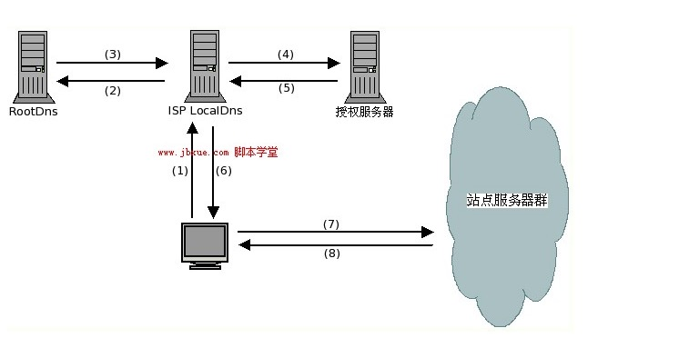
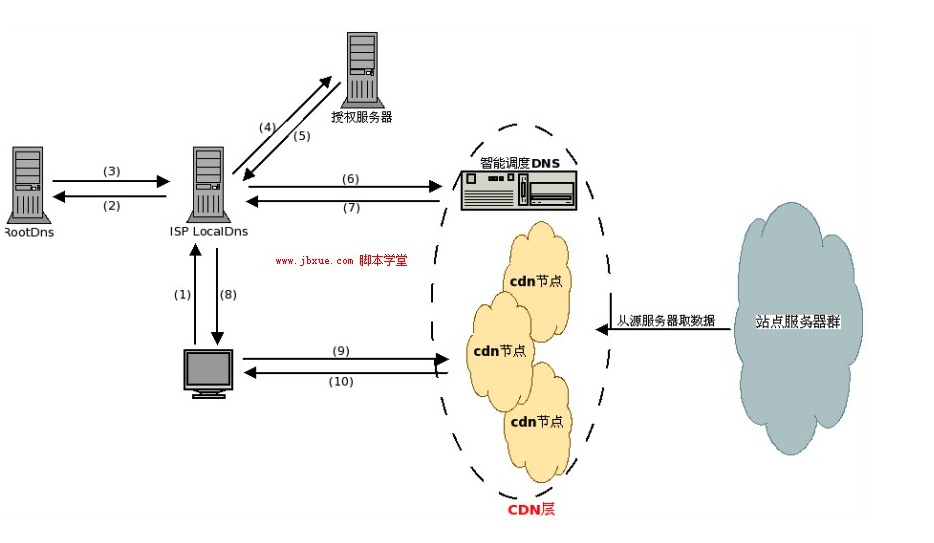
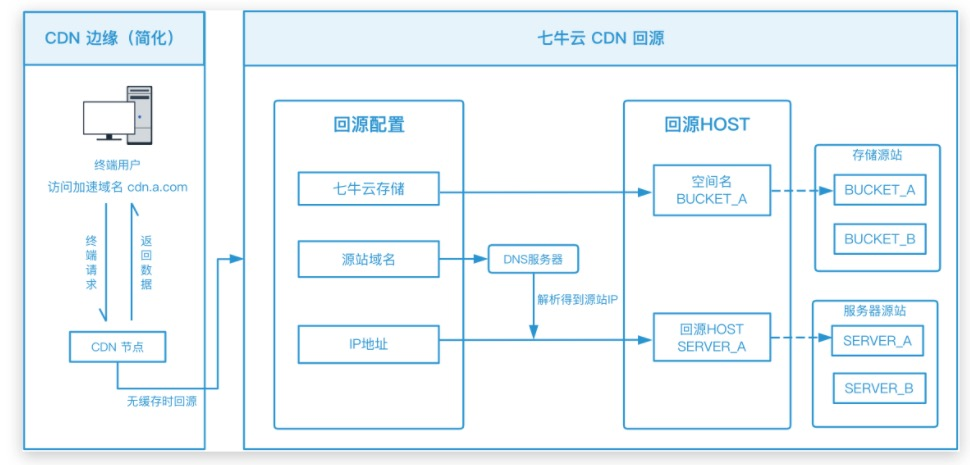

[参考资料](https://blog.csdn.net/xiangzhihong8/article/details/83147542)
[参考资料](https://juejin.cn/post/6854573212425814030)

### 什么是 CDN

CDN 全称是 content delivery network，即内容分发网络，一组分布在各个地区的服务器。
其目的是通过在现有的 Internet 中增加一层新的网络架构，将网站的内容发布到最接近用户的网络“边缘”，使用户可以就近取得所需的内容，提高用户访问网站的响应速度。
从技术上全面解决由于网络带宽小、用户访问量大、网点分布不均等问题，提高用户访问网站的响应速度。

### 工作原理

- 未使用 CDN
  

- 使用 CDN
  

**CDN 网络是在用户和服务器之间增加 Cache 层，主要是通过接管 DNS 实现，将用户的请求引导到 Cache 上获得源服务器的数据，从而降低网络的访问时间。**

### 原理分析

在没有应用 CDN 时，我们使用域名访问某一个站点时的路径为

用户提交域名 → 浏览器对域名进行解释 →DNS 解析得到目的主机的 IP 地址 → 根据 IP 地址访问发出请求 → 得到请求数据并回复

应用 CDN 后，DNS 返回的不再是 IP 地址，而是一个 CNAME(Canonical Name ) 别名记录，指向 CDN 的全局负载均衡

CNAME 实际上在域名解析的过程中承担了中间人（或者说代理）的角色，这是 CDN 实现的关键

负载均衡系统
由于没有返回 IP 地址，于是本地 DNS 会向负载均衡系统再发送请求 ，则进入到 CDN 的全局负载均衡系统进行智能调度：

看用户的 IP 地址，查表得知地理位置，找相对最近的边缘节点

看用户所在的运营商网络，找相同网络的边缘节点

检查边缘节点的负载情况，找负载较轻的节点

其他，比如节点的“健康状况”、服务能力、带宽、响应时间等

结合上面的因素，得到最合适的边缘节点，然后把这个节点返回给用户，用户就能够就近访问 CDN 的缓存代理

### CDN 回源原理



回源：**CDN 发现自己没有这个资源（一般是缓存的数据过期了），转头向根服务器（或者它的上层服务器）去要这个资源的过程。**

- 源站内容有更新的时候，源站主动把内容推送到 CDN 节点。

- 常规的 CDN 都是回源的。即：当有用户访问某一个 URL 的时候，如果被解析到的那个 CDN 节点没有缓存响应的内容，或者是缓存已经到期，就会回源站去获取。如果没有人访问，那么 CDN 节点不会主动去源站拿的。

- 回源域名一般是 cdn 领域的专业术语，通常情况下，是直接用 ip 进行回源的，但是如果客户源站有多个 ip，并且 ip 地址会经常变化，对于 cdn 厂商来说，为了避免经常更改配置（回源 ip），会采用回源域名方式进行回源，这样即使源站的 ip 变化了，也不影响原有的配置。

### CDN 相关技术

- 负载均衡
- 动态分发与复制技术
- 缓存技术

### 常见概念

源站： 源站决定了回源时，请求到哪个 IP

回源 host：回源 host 决定回源请求访问到该 IP 上的哪个站点

```js
例子：

1、源站是域名

源站为www.a.com，回源host为www.b.com

那么实际回源是请求到www.a.com解析到的IP，对应的主机上的站点www.b.com


2、源站是IP

源站为1.1.1.1，回源host为www.b.com

那么实际回源的是1.1.1.1对应的主机上的站点www.b.com
```

- 为什么加速域名和源站域名不能相同？

一个域名最终只解析到一个位置，即解析到 CDN 加速节点后，将无法用于获取源站的 IP 信息，所以加速域名和源站域名无法配置为同一个域名。
