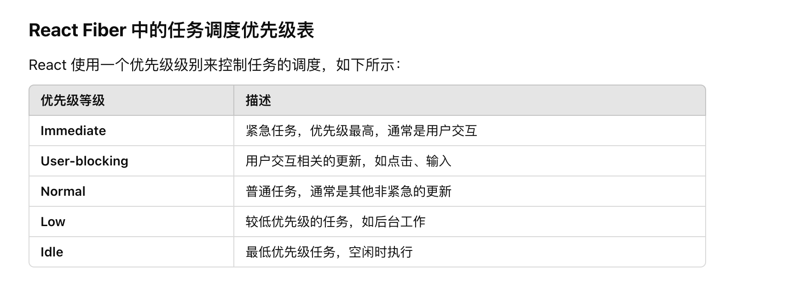

## 16版本之前存在的问题

- 同步渲染
React 的组件更新过程会从根组件递归地遍历整个组件树，每次更新必须同步完成，直到渲染结束。
如果组件树较大或更新逻辑复杂，可能导致浏览器的主线程长时间被阻塞，出现卡顿或掉帧。
- 递归遍历
使用 JavaScript 的函数调用堆栈（stack）递归地遍历组件树，每个组件的渲染完成后，依赖调用堆栈返回控制权。这限制了 React 在组件更新过程中的灵活性，例如中断渲染或优先处理更高优先级的更新。
- 不可分片的更新
所有的渲染和更新操作是不可中断的，如果更新操作过于耗时，用户可能会感受到明显的性能问题，例如 UI 不响应输入或动画卡顿。

在 React 16 之前的版本对比更新 VirtualDOM 的过程是采用 Stack 架构实现的，也就是循环加递归。
这种对比方式有一个问题，就是一旦任务开始进行就无法中断，如果应用中的组件数量庞大，Virtual DOM 的层级比较深，主线程被长期占用，
直到整棵 VirtualDOM 树比对更新完成之后主线程才能被释放，主线程才能执行其他任务。这就会导致一些用户交互，动画等任务无法立即得到执行，
页面就会产生卡顿, 非常的影响用户体验。
核心思想： **是将渲染过程分解成更小的任务块，从而更好地控制渲染优先级**
核心问题：**递归无法中断，执行任务耗时长，JavaScript 是单线程的，和 Native GUI 互斥，比较 VirtualDOM 的过程中无法执行其他任务，导致任务延迟页面卡顿，用户体验差。**

## Fiber数据结构
是一种链表树结构，每一个节点表示一个react元素或组件实例。
它包括

- type：当前节点的组件类型。
- key：用于标识当前节点的唯一性（React 中的 key）。
- stateNode：与当前节点对应的实例（DOM 节点或类组件实例）。
- child / sibling / return：分别表示当前节点的子节点、兄弟节点和父节点。
- pendingProps / memoizedProps：更新前后的属性。
- effectTag：描述当前节点需要执行的更新类型（如插入、删除或更新）。

**Fiber 是 React 的一个执行单元，在 React 16 之后，React 将整个渲染任务拆分成了一个个的小任务进行处理，每一个小任务指的就是 Fiber 节点的构建。
拆分的小任务会在浏览器的空闲时间被执行，每个任务单元执行完成后，React 都会检查是否还有空余时间，如果有就交换主线程的控制权。**

## 核心特点
- 时间切片
Fiber 将渲染任务拆分为多个小的可中断任务块，允许 React 在处理任务时暂停，检查是否有更高优先级的任务需要完成。
- 优先级调度
每个更新任务都会被分配一个优先级，根据任务的重要性（如用户交互、动画、数据更新等）决定执行的顺序和时机。
- 异步渲染
React 不再一次性完成整个组件树的渲染，而是逐步完成，确保页面的响应性。
- 可恢复任务
如果任务在中途被中断，Fiber 可以记录当前的执行状态，稍后继续完成任务，而不需要从头重新开始。

- 任务分割与调度：React 通过 Fiber 将渲染过程拆分成多个小任务，这样可以根据任务的优先级动态地调度它们。这就意味着 React 不需要一次性完成所有渲染任务，而是可以在合适的时候暂停、恢复或中断渲染任务，确保重要任务（如用户点击、滚动等）能够优先得到处理。

- 增量渲染：之前的 React 渲染模型是同步的，一旦开始渲染，就会一直渲染到底，直到完成。但 Fiber 允许增量渲染，即渲染过程可以被分割成多个小片段，每次渲染少量内容，可以在渲染过程中进行任务切换，避免阻塞主线程，提高响应速度。

- 优先级控制：Fiber 让 React 在执行任务时可以按优先级对任务进行排序。比如，当用户交互（点击、输入等）发生时，React 会优先执行这些操作的渲染，确保 UI 响应及时。

- 异步渲染：通过 Fiber，React 支持异步渲染任务，确保长时间运行的任务（比如动画、数据加载等）不会阻塞主线程，避免页面卡顿。

## 解决思路
- 在 Fiber 架构中 React 放弃了递归调用，采用循环来模拟递归，因为循环可以随时被中断。
- Fiber 将大的渲染任务拆分成一个个小任务
- React 使用 requestIdleCallback 去利用浏览器的空闲时间去执行小任务，React 在执行一个任务单元后，查看是否有其他高优先级的任务，如果有，放弃占用线程，先执行优先级高的任务

## React Fiber 的优势
1. 更高的性能：通过分片和优先级调度优化大规模渲染性能。
2. 平滑的用户体验：避免长时间阻塞主线程，提升交互响应速度。

## 任务优先级
