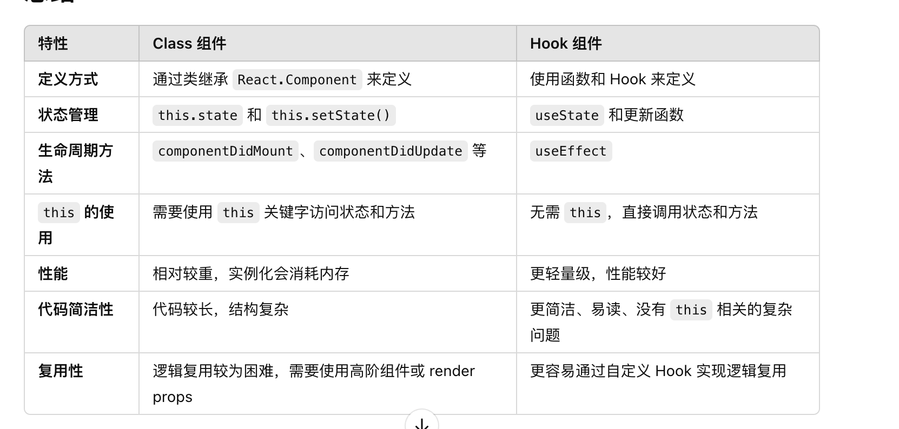

### 什么是高阶组件

高阶组件（HOC）是 React 中用于复用组件逻辑的一种高级技巧。HOC 自身不是 React API 的一部分，它是一种基于 React 的组合特性而形成的设计模式。

具体而言，高阶组件是参数为组件，返回值为新组件的函数。


高阶组件是个纯函数，没有副作用。

使用事项：
1.不要改变原始组件，使用组合。
2.将不相关的 props 传递给被包裹的组件
3.约定：最大化可组合性

### 组件的生命周期

    componentWillMount -- 多用于根组件中的应用程序配置
    componentDidMount -- 在这可以完成所有没有 DOM 就不能做的所有配置，并开始获取所有你需要的数据；如果需要设置事件监听，也可以在这完成
    componentWillReceiveProps -- 这个周期函数作用于特定的 prop 改变导致的 state 转换
    shouldComponentUpdate -- 如果你担心组件过度渲染，shouldComponentUpdate 是一个改善性能的地方，因为如果组件接收了新的 prop， 它可以阻止(组件)重新渲染。shouldComponentUpdate 应该返回一个布尔值来决定组件是否要重新渲染
    componentWillUpdate -- 很少使用。它可以用于代替组件的 componentWillReceiveProps 和 shouldComponentUpdate(但不能访问之前的 props)
    componentDidUpdate -- 常用于更新 DOM，响应 prop 或 state 的改变
    componentWillUnmount -- 在这你可以取消网络请求，或者移除所有与组件相关的事件监听器


### setState

  setState是异步的。每次调用setState都会触发更新，异步操作是为了提高性能，将多个状态合并一起更新，减少re-render调用。

  ```js
  // num将会只是1
    for ( let i = 0; i < 100; i++ ) {
        this.setState( { num: this.state.num + 1 } );
    }

  // 对象式
  this.setState(object, [callback])
  // 函数式
  this.setState(function, [callback])
  ```

  
  **如果对象式和函数式的setState混合使用，则对象式的会覆盖前面无论函数式还是对象式的任何setState，但是不会影响后面的setState。**
  
  1. setState在react生命周期和合成事件会批次覆盖执行。比如当多个setState调用的时候会提取传递setState对象，就像Object.assign的对象合并，相同最后的一个key会覆盖前面的key

  2. setState在原生事件，setTimeout，setInterval，Promise等异步操作中，state会同步更新。多次连续操作setState，每次都会re-render，state会同步更新。

  **setState的调用会引起React的更新生命周期的4个函数执行。**

    shouldComponentUpdate
    返回true,不更新state，进行下一步；返回false，更新state
    componentWillUpdate
    在此阶段也没有更新state
    render
    更新state
    componentDidUpdate

   **setState的缺点**

    1. **setState可能循环调用。**在shouldComponentUpdate没有返回false，且在其他三个会经历setState的周期函数里调用会形成循环调用，最终导致浏览器内存占满后崩溃

    2. 引发不必要的渲染。

    3. 不能总是有效管理组件中的所有所有状态。某些与视图无关的state用setState去管理不合适。

### 国际化单复数处理

1. 可以定义不同的词条，根据count的判断去选择不同词条
2. Plurals 国际化插件
3. 利用initReactI18next.plural处理
```js

import i18n from 'i18next';
import { initReactI18next } from 'react-i18next';

i18n.use(initReactI18next).init({
  resources: {
    en: {
      translation: {
        "change": "{{count}} change",
        "change_plural": "{{count}} changes",
      },
    },
    fr: {
      translation: {
        "change": "{{count}} changement",
        "change_plural": "{{count}} changements",
      },
    },
  },
  lng: "en", // 默认语言
  fallbackLng: "en", // 回退语言
  interpolation: {
    escapeValue: false, // React 自动转义
  },
});

export default i18n;

```

```jsx
import React from 'react';
import { useTranslation } from 'react-i18next';

const App = () => {
  const { t } = useTranslation();
  const changes = 3; // 示例数据
  return (
    <div>
      <p>{t('change', { count: changes })}</p>
    </div>
  );
};

export default App;
```


### 使用React.memo是否总能提升性能
 结论： **使用memo并不能总是提高性能，它的效果取决于组件的结构和渲染频率。**
工作原理： **memo是一个高阶组件，会记住上一次渲染的结果，如果组件的props没有发生变化，就会跳过渲染，直接使用上一次的渲染结果，以此减少不必要的渲染，提高性能。**
性能提升的条件：**memo只有在组件的props没有变化时才有效，如果每次渲染时传递给组件的props都不同（即使是一些小变动）。那么memo都有可能不会带来明显的性能提升，反而会增加性能开销。**
优化机制：**React.memo 默认使用浅比较来判断 props 是否发生变化。如果 props 是一个对象，React.memo 会比较对象的引用地址，而不是深度比较对象的内容。如果你传递的 props 是一个复杂的对象（例如数组或对象），即使其内部的内容没有变化，只要对象的引用发生变化，React.memo 也会触发重新渲染。**
使用场景：**1.组件依赖于不经常发生变化的props  2.复杂的UI组件**


### useReducer和redux的区别

useReducer:
1. 组件级别的状态管理
2. react原生hooks，使用简单
3. 不支持中间件
4. 无调试工具


redux: 
1. 全局的状态管理
2. 依赖第三方，使用复杂
3. 支持中间件
4. 提供redux-devtools调试工具
5. redux 中可以通过中间件（如 redux-thunk）处理异步操作

### 不可变数据
**在 React 中，不可变数据（Immutable Data）指的是数据在修改时不会直接修改原始数据，而是创建新的副本来表示修改后的数据。**

- 为什么要使用
**react是通过组件的props和state决定是否需要重新渲染组件。在不可变数据模型下，判断数据是否发生发生变化，只需要比较数据的引用是否发生变化。**
1. 快速比较。浅比较来判断的，如果数据是不可变的，react只需比较数据的引用是否发生变化，而不是深度遍历对象或数组的内容。
2. 性能优化。避免直接修改原始数据，避免不必要的渲染。
3. 更利于调试。


- 实现原则
1. 不可修改原始数据。不直接修改对象或数据，使用方法生成一个新的副本。
2. 返回新的副本

- 如何实现
1. 对象时，利用Object.assign
2. 数组时，利用...扩展
3. 第三方工具库Immutable.js、Immer


### Suspense
<Suspense> 允许在子组件完成加载前展示后备方案。

Suspense是根据捕获子组件内的异常来实现决定展示哪个组件的。这有点类似于ErrorBoundary ，
不过ErrorBoundary是捕获 Error 时就展示回退组件，
而Suspense 捕获到的 Error 需要是一个Promise对象（并非必须是 Promise 类型，thenable 的都可以）。

我们知道 Promise 有三个状态，pending、fullfilled、rejected ，
当我们进行远程数据获取时，会创建一个Promise，
我们需要直接将这个Promise 作为Error进行抛出，
由 Suspense 进行捕获，
捕获后对该thenable对象的then方法进行回调注册thenable.then(retry) ,
而 retry 方法就会开始一个调度任务进行更新，后面会详细讲。


### useEffect为什么会执行两次
仅在开发模式下，使用严格模式下会触发。

之所以执行两次：**是因为模拟立即卸载组件和重新挂载组件，帮助开发者提前发现和重复挂载造成的bug.**


### 函数组件和类组件比较
