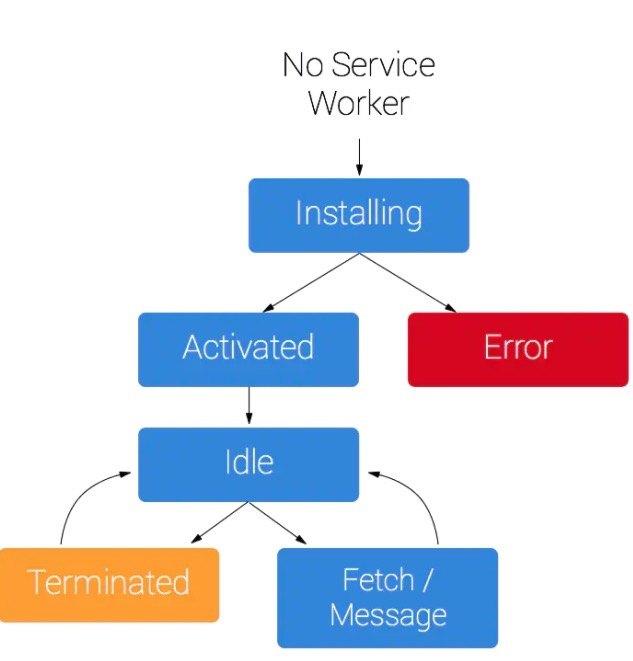

[离线缓存](https://blog.csdn.net/weixin_39939012/article/details/102730199?utm_medium=distribute.pc_relevant.none-task-blog-baidujs_title-0&spm=1001.2101.3001.4242)


[参考文档](https://developer.mozilla.org/zh-CN/docs/Web/API/Service_Worker_API)
[参考文档](https://www.jianshu.com/p/cc506d408d69)

[参考文档-使用](https://blog.csdn.net/mevicky/article/details/86605882)
[参考文档-使用](https://segmentfault.com/a/1190000015050724)


[报错解决](https://stackoverflow.com/questions/49566059/service-worker-registration-error-unsupported-mime-type-text-html)


## chrome devtool
chrome://serviceworker-internals/

## 注意
1. 只能在https或localhost下使用

## 注册

```js
  // 如果这个前端服务挂在http://localhost:8080下
  // 那一定要保证http://localhost:8080/sw.js可以访问！！！！！
  // 否则报错
  // 报错信息如下：
  // DOMException: Failed to register a ServiceWorker for scope
  // ('http://localhost:8080/') with script 
  // ('http://localhost:8080/sw1./// js'):
  // The script has an unsupported MIME type ('text/html').
  if ('serviceWorker' in navigator) {
    // 在页面加载后
    window.addEventListener('load', function () {
      // 这里的路径也是个坑
      // 如果定义为/a/sw.js
      // 则指会对http://localhost:8080/a下进行优化
      navigator.serviceWorker.register('./sw.js')
      .then(reg => { //注册成功
          console.log('注册成功', reg)
      }).catch(err => { //注册成功
          console.log('注册失败', err)
      })
    });
  } else {
      console.log('当前浏览器不支持SW')
  }

```
## 生命周期


## PWA应用库

workbox
## 插件

workbox-webpack-plugin