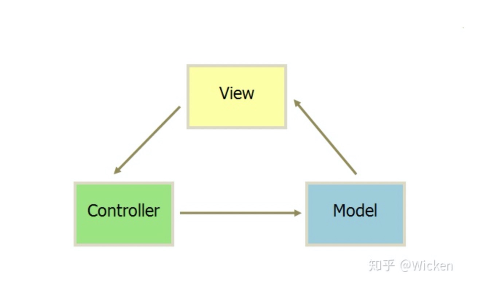
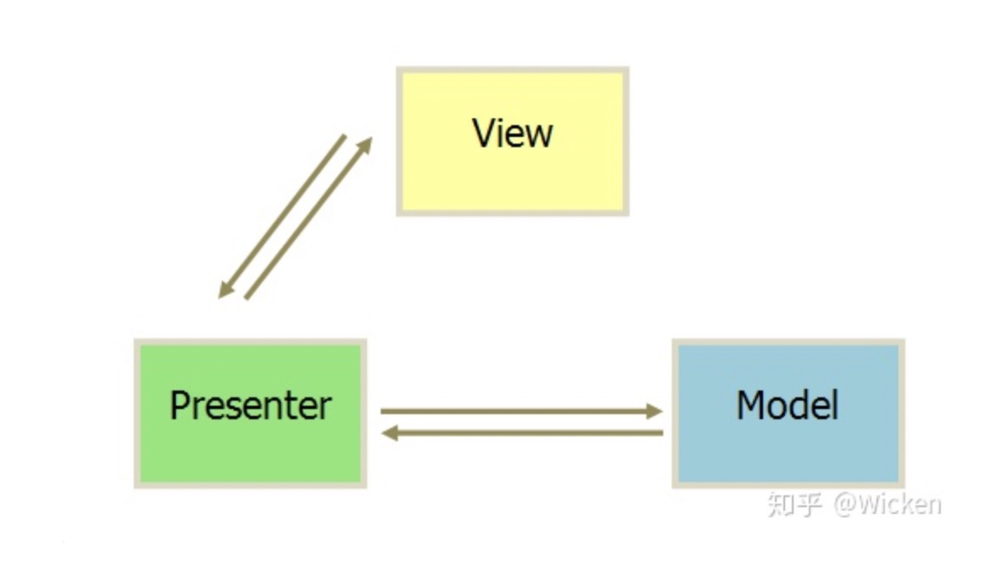
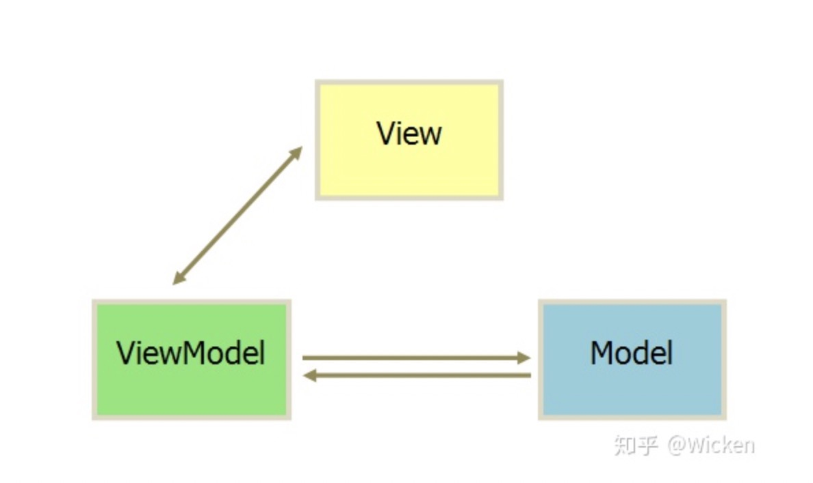

### MVC

Model（模型）表示应用程序核心（如数据库）。

View（视图）显示效果（HTML页面）。

Controller（控制器）处理输入（业务逻辑）。

MVC 模式同时提供了对 HTML、CSS 和 JavaScript 的完全控制。

我们可以先暂时抛开框架，MVC的流程大概就是，html（View）操作，告知js（Controller）要更新数据（Model）啦，js（Controller）经过请求也好啥也好，更新了数据（Model），然后再告诉html(View)找指定的UI节点去更新数据。当然这里也可以直接由js（Controller）发起对数据（Model）的更新，流程差不多也是一样的。

其实流程列出来我们就可以看到，这样的架构模式在早期的web应用中可以适应的很好。因为早期的web应用，页面的作用基本也就作为数据展示使用。Model层可以将数据处理好后通知View层渲染，就像jquery拿到ajax数据之后找到元素一顿innerHtml啥的。

但随着web的发展，业务逻辑的复杂，可以发现这种架构模式以下两个问题：

1、View更新的时候，必须要通过Controller去更新一遍Model；同样的Model更新的时候，也要去更新一遍视图。此时开发者是在同时维护View层和Model层。当页面复杂的时候，开发者不得不做许多繁琐的工作来保证数据的状态、页面的展示都是正确的。

2、View层与Model层耦合，复用性差。比方说，我点击一个按钮，更新了Model并将数据渲染为List；这是我再点击一个按钮，同样更新这份数据但是渲染为Table。这个时候，由于之前逻辑已经连成一块，我们不得不再写一套渲染代码。

3、同样是由于View和Model耦合，数据流会十分混乱。比如改变了Model，这时View的更新又触发了另一个Controller，使得另一个Model又更新了，这就会使数据流像意大利面条一样缠在一起。

---

### MVP

不过此时的Controller层变成了Presenter（中介者）层，Presenter层既能将页面操作告知Model进行数据更新，又能在数据更新时负责通知View进行更新视图，使View层与Model层解耦。

针对上述问题2，在MVP架构模式下，Model层将数据返回给Presenter，再由Presenter决定我是渲染Table呢，还是渲染List。这种架构模式下，加强了Presenter的职能，这样就解决了上述问题

---

### MVVM

MVVM: model-view-viewmodel
Model:数据模型
View:UI组件
ViewModel:监听数据模型的改变和控制视图的行为、处理交互行为，可以理解为同步View和Model的对象，连接两者.
在MVVM架构下，View 和 Model 之间并没有直接的联系，而是通过ViewModel进行交互，Model 和 ViewModel 之间的交互是双向的， 
因此View 数据的变化会同步到Model中，而Model 数据的变化也会立即反应到View 上。
ViewModel 通过双向数据绑定把 View 层和 Model 层连接了起来，而View 和 Model 之间的同步工作完全是自动的，无需人为干涉。

# MVVM和MVP的区别

MVVM采用了双向绑定的方案，view的变动，自动反应再viewModel上，无需手动操作。

