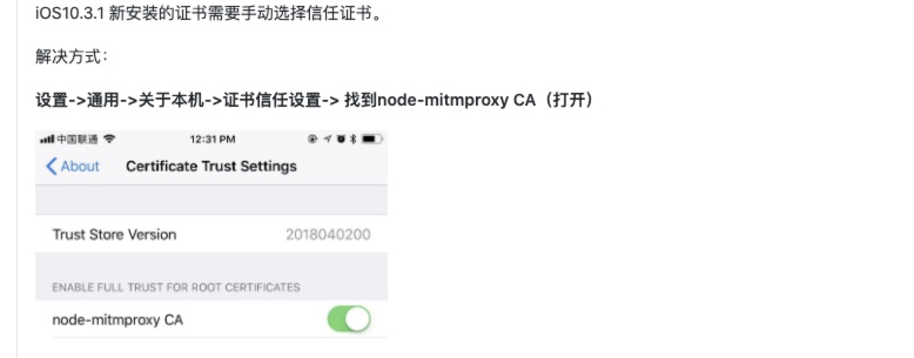

# inspect

**以下操作都需要翻墙！！！！**

[参考链接](https://github.com/RemoteDebug/remotedebug-ios-webkit-adapter#getting-started)
```bash
brew update
brew unlink libimobiledevice ios-webkit-debug-proxy usbmuxd
brew uninstall --force libimobiledevice ios-webkit-debug-proxy usbmuxd
brew install --HEAD usbmuxd
brew install --HEAD libimobiledevice
brew install --HEAD ios-webkit-debug-proxy
```

### 异常错误
[参考连接](https://blog.csdn.net/survivorsfyh/article/details/103960551)
- 错误
```
fatal: unable to access 'https://github.com/Homebrew/homebrew-core/': LibreSSL SSL_read: SSL_ERROR_SYSCALL, errno 54
Error: Failure while executing; `git clone https://github.com/Homebrew/homebrew-core /usr/local/Homebrew/Library/Taps/homebrew/homebrew-core --depth=1` exited with 128.
Error: Failure while executing; `/usr/local/bin/brew tap homebrew/core` exited with 1.
Failed during: /usr/local/bin/brew update --force

```

- 解决方法
```
git clone git://mirrors.ustc.edu.cn/homebrew-core.git/ /usr/local/Homebrew/Library/Taps/homebrew/homebrew-core --depth=1
cd "$(brew --repo)" 
git remote set-url origin https://mirrors.ustc.edu.cn/brew.git
cd "$(brew --repo)/Library/Taps/homebrew/homebrew-core" 
git remote set-url origin https://mirrors.ustc.edu.cn/homebrew-core.git
brew update
```

- 错误
```
Permission denied @ apply2files - /usr/local/lib/node_modules/expo-cli/node_modules/extglob/lib/.DS_Store
```

- 解决方法

```
sudo chown -R ${LOGNAME}:staff /usr/local/lib/node_modules
```

### IOS上的Safari

    1.在iOS设备上打开允许调试：设置→Safari→高级→打开”web检查器“
    2.在MAC上打开Safari的开发菜单：顶部菜单栏“Safari”→偏好设置→高级→打开”在菜单栏中显示“开发”菜单
    3.在iOS设备上的Safari浏览器中打开要调试的页面，然后切换到MAC的Safari，在顶部菜单栏选择“开发”→找到你的iOS设备名称→右边二级菜单选择需要调试的对应标签页，即可开始远程调试


### 安卓手机
[离线包](https://www.cnblogs.com/slmk/p/9832081.html)

### 注意

**ios手机在chrome上不能inspect，但如果手机safari上打开网页，mac在safari里开发者模式可以**
**安卓手机可以inspect但也需要翻墙,可采用离线包方式（没试过）**


----


# spy-debugger

[参考文档](https://github.com/wuchangming/spy-debugger)

注意：

安装：
```bash
sudo npm install spy-debugger -g

```


##### 第一步：手机和PC保持在同一网络下（比如同时连到一个Wi-Fi下）

#####  第二步：命令行输入spy-debugger，按命令行提示用浏览器打开相应地址。

##### 第三步：设置手机的HTTP代理，代理IP地址设置为PC的IP地址，端口为spy-debugger的启动端口(默认端口：9888)。

#####  Android设置代理步骤：设置 - WLAN - 长按选中网络 - 修改网络 - 高级 - 代理设置 - 手动
iOS设置代理步骤：设置 - 无线局域网 - 选中网络 - HTTP代理手动


- 如果ios手机证书下载不了可参考[解决方案](https://juejin.cn/post/6844904014971142151)，
**特别注意fetchCrtFile端口下载文件和服务端口不一一样！！！！！另外如果还是不能下载，可尝试切换端口重启电脑等**
- 首次代理需要安装证书并取得信任



### IOS手机配置代理

- 无线局域网=》选中网络=》配置代理=》手动 =》ip、端口=>存储


### 参考的文档

[参考文档1](https://github.com/mrdulin/blog/issues/50)
[参考文档2](https://github.com/RemoteDebug/remotedebug-ios-webkit-adapter)
[参考文档3](https://github.com/jieyou/remote_inspect_web_on_real_device#chrome%E6%A8%A1%E6%8B%9F%E5%99%A8)
[参考文档4](https://github.com/RemoteDebug/remotedebug-ios-webkit-adapter/issues/109)
[参考文档5](https://github.com/wuchangming/spy-debugger)