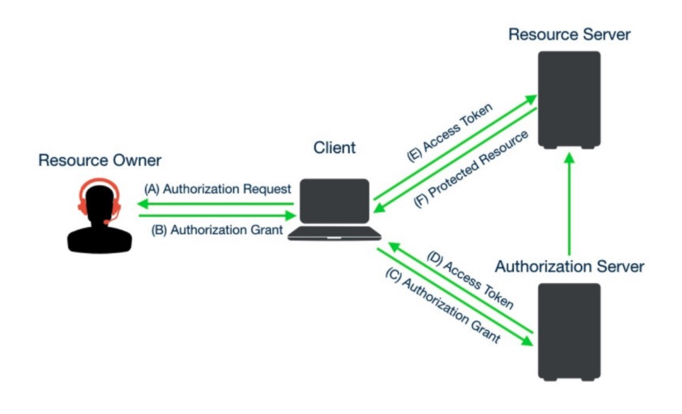

### OAuth 2.0 是目前最流行的授权机制，用来授权第三方应用，获取用户数据。

**简单说，OAuth 就是一种授权机制。数据的所有者告诉系统，同意授权第三方应用进入系统，获取这些数据。系统从而产生一个短期的进入令牌（token），用来代替密码，供第三方应用使用。**

### 工作流程

### 授权方式

OAuth 2.0 规定了四种获得令牌的流程。你可以选择最适合自己的那一种，向第三方应用颁发令牌。即以下四种授权方式：

- 授权码（authorization-code）
- 隐藏式（implicit）
- 密码式（password）
- 客户端凭证（client credentials）

### OAuth2 优缺点
- 优点：
适合快速开发实施，代码量少，API需要被不同APP使用，且每个APP使用方式也不同的情况。

- 缺点：
学习和理解的成本比较大，并且 OAuth2 不是一个严格的标准协议，在实施过程中更容易出错。

[参考资料](https://blog.csdn.net/qq_24313635/article/details/106900838)
[参考资料](http://www.ruanyifeng.com/blog/2019/04/oauth-grant-types.html)