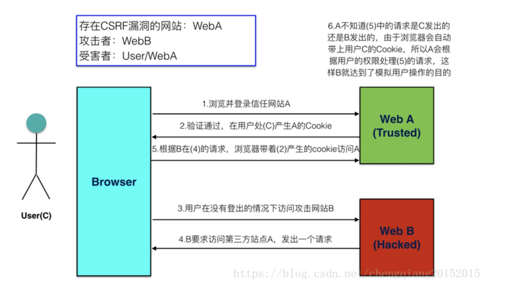

# XSS 攻击 跨站脚本攻击

**恶意脚本代码**
XSS 攻击：跨站脚本攻击(Cross-Site Scripting)，为了不和层叠样式表(Cascading Style Sheets, CSS)的缩写混淆，故将跨站脚本攻击缩写为 XSS。XSS 是一种常见的 web 安全漏洞，它允许攻击者将恶意代码植入到提供给其它用户使用的页面中。不同于大多数攻击(一般只涉及攻击者和受害者)，XSS 涉及到三方，即攻击者、客户端与 Web 应用。XSS 的攻击目标是为了盗取存储在客户端的 cookie 或者其他网站用于识别客户端身份的敏感信息。一旦获取到合法用户的信息后，攻击者甚至可以假冒合法用户与网站进行交互。

一类是存储型 XSS，主要出现在让用户输入数据， 供其他浏览此页的用户进行查看的地方，包括留言、评论、博客日志和各类表单等。应用程序从数据库中查询数据，在页面中显示出来，攻击者在相关页面输入恶意的脚本数据后，用户浏览此类页面时就可能受到攻击。这个流程简单可以描述为 —— 恶意用户的 Html 输入 web 程序 -> 进入数据库 -> web 程序 -> 用户浏览器。

另一类是反射型 XSS，主要是将脚本加入 URL 地址的程序参数里，参数进入程序后在页面直接输出脚本内容，用户点击类似的恶意链接就可能受到攻击。

#### 如何预防

不要信任用户任何的输入。

    1.避免 XSS 的方法之一主要是将用户所提供的内容进行过滤(如上面的 script 标签、img 标签)。
    2. 编码。在输入“<”、“>”等进行编码
    3. 由于要窃取的是cookie等敏感信息，设置cookie属性，HttpOnly，在客户端无论如何也拿不到cookie了。

```js
// 1
<div id=”board”>
    <script>alert("hey!you are attacked")</script>
</div>
// 2 由于没有这个图片地址。肯定会走失败函数
http://192.168.1.102/xss/example6.php?name=";alert("I am
coming again~");"
```

---

# SQL 注入(SQL Injection)

[参考文档](https://blog.csdn.net/yue510/article/details/92431748)
**是通过用 SQL 语句伪造参数发出攻击**
就是通过把 SQL 命令插入到 Web 表单递交或输入域名或页面请求的查询字符串，最终达到欺骗服务器执行恶意的 SQL 命令。
攻击者成功的向服务器提交恶意的 SQL 查询代码，程序在接收后错误的将攻击者的输入作为查询语句的一部分执行，导致原始的查询逻辑被改变，额外的执行了攻击者精心构造的恶意代码。

#### 如何预防

1.对进入数据库的特殊字符（'"\尖括号&\*;等）进行转义处理，或编码转换。

---

# DDOS

**发出大量请求，最后令服务器崩溃**
什么是 DDOS
DDOS：分布式拒绝服务攻击（Distributed Denial of Service），简单说就是发送大量请求是使服务器瘫痪。DDos 攻击是在 DOS 攻击基础上的，可以通俗理解，dos 是单挑，而 ddos 是群殴，因为现代技术的发展，dos 攻击的杀伤力降低，所以出现了 DDOS，攻击者借助公共网络，将大数量的计算机设备联合起来，向一个或多个目标进行攻击。

在技术角度上，DDoS 攻击可以针对网络通讯协议的各层，手段大致有：TCP 类的 SYN Flood、ACK Flood，UDP 类的 Fraggle、Trinoo，DNS Query Flood，ICMP Flood，Slowloris 类等等。一般会根据攻击目标的情况，针对性的把技术手法混合，以达到最低的成本最难防御的目的，并且可以进行合理的节奏控制，以及隐藏保护攻击资源。

下面介绍一下 TCP 协议中的 SYN 攻击。

SYN 攻击
在三次握手过程中，服务器发送 SYN-ACK 之后，收到客户端的 ACK 之前的 TCP 连接称为半连接(half-open connect)。此时服务器处于 SYN_RCVD 状态。当收到 ACK 后，服务器才能转入 ESTABLISHED 状态.

SYN 攻击指的是，攻击客户端在短时间内伪造大量不存在的 IP 地址，向服务器不断地发送 SYN 包，服务器回复确认包，并等待客户的确认。由于源地址是不存在的，服务器需要不断的重发直至超时，这些伪造的 SYN 包将长时间占用未连接队列，正常的 SYN 请求被丢弃，导致目标系统运行缓慢，严重者会引起网络堵塞甚至系统瘫痪。

#### 如何预防 DDOS

阿里巴巴的安全团队在实战中发现，DDoS 防御产品的核心是检测技术和清洗技术。检测技术就是检测网站是否正在遭受 DDoS 攻击，而清洗技术就是清洗掉异常流量。而检测技术的核心在于对业务深刻的理解，才能快速精确判断出是否真的发生了 DDoS 攻击。清洗技术对检测来讲，不同的业务场景下要求的粒度不一样。


---

# CSRF 跨站请求伪造

[参考资料](https://www.cnblogs.com/hyddd/archive/2009/04/09/1432744.html)
**关键是借助本地 cookie 进行认证，伪造发送请求**


CSRF（Cross-site request forgery），中文名称：跨站请求伪造，也被称为：one click attack/session riding，缩写为：CSRF/XSRF。

你这可以这么理解 CSRF 攻击：攻击者盗用了你的身份，以你的名义发送恶意请求。CSRF 能够做的事情包括：以你名义发送邮件，发消息，盗取你的账号，甚至于购买商品，虚拟货币转账......造成的问题包括：个人隐私泄露以及财产安全。

完成一次 CSRF 攻击，受害者必须一次完成两个步骤。 1.登陆受信任网站 A，并在本地生成 cookie 2.在不退出 A 的情况下，访问危险网站 B

#### 如何预防 DDOS

1.cookie 加密
2. 提交信息加入 hash、token等

